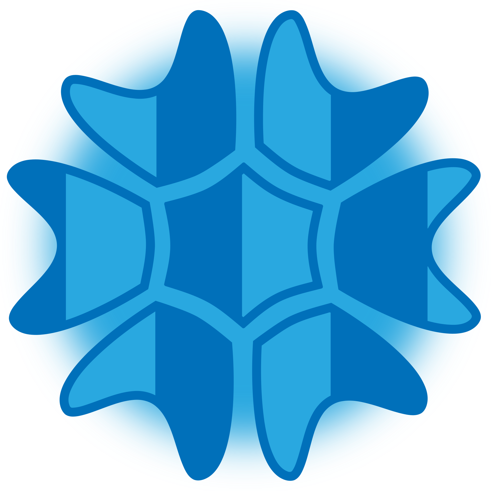

<p align="center">
  <a href="https://algacss.tedir.dev" target="_blank" rel="noopener noreferrer">
    
  </a>
</p>

<p align="center">
  <a href="https://npmcharts.com/compare/alga-css?minimal=true"></a>
  <a href="https://www.npmjs.com/package/alga-css"></a>
  <a href="https://www.npmjs.com/package/alga-css"></a>
</p>
<br/>

# Alga CSS
Alga CSS is a scope or component oriented CSS toolkit for quickly reuse CSS components via `@use` directive and it can be stored in `.alga` format file as a custom CSS component using `@alga` directive and also it has many built-in customizable CSS properties that can be directly inserted to HTML Element class, visit [https://algacss.com](https://algacss.com 'Alga CSS').

This Alga CSS is still in a beta version, so it is not stable yet, a lot of features or built-in components need to be added and for the documentation is also still in the development stage, so we expected it will finish around 2024 and it will be stable after that. Because of that, if you use this Alga CSS, please check the examples folder, I put all the HTML/UI testing files in that folder and test folder as well.

Moreover, we're prioritizing this Alga CSS for all of the projects that being handled by the Author both personal projects and the client projects, so we built all the components according to the client need and their feedback.

All the main features:
1. Created for scoped CSS
2. As a PostCSS plugin
3. Can be store as a CSS component
4. Extract classes from any major JS Frameworks

## Installation and Setup
Alga CSS built on top of PostCSS, so before installing Alga CSS, you need to have PostCSS first and after that you can use NPM or Yarn to install this Alga CSS.

```sh
npm install alga-css --save-dev

#or

yarn add alga-css
```

If you use tool that support PostCSS out of the box like Vite for instance, you just need to create a new config file which is `postcss.config.cjs` and add the code below to that file.

```js
const algacss = require('alga-css')

module.exports = {
  plugins: [
    algacss({
      extract: [
        './src/**/*.html', 
        './src/**/*.{otherFormat}'
      ],
      src: './src/styles/*.alga'
    })
  ]
}
```

## Class Name Structure
Alga CSS uses special character `-` to gab classes from HTML elements or Vue components, and it uses `:` for breakpoints and states and also `_` as a divider or separator of css values.

```css
/* highly recommended */
<span class="marginTop-0.75rem padding-10px md:marginTop-5pct color-rgb(205,45,67) backgroundColor-hexfff"></span>

.className {
  ref: marginTop-0.75rem padding-10px color-rgb(205,45,67) backgroundColor-hexfff;
  screen-md: marginTop-5pct;
}

/* class structure: property (camelCase for prop name and prop value separated by - or dash) */
justifyContent-spaceBetween

/* class structure: unit size (pct is unit size in percent) */
width-100pct
height-250px
padding-1.75rem

/* class structure: screen, ss (extra small), sr (smaller), sm (small), md (medium), lg (large), lr (larger), ls (largest), wd (wide), wr (wider) */
ss:paddingLeft-3px

/* class structure: mode */
dark:backgroundColor-hex242424
light:backgroundColor-hexf2f2f2

/* (prefers-color-scheme: light) { [data-mode=dark] .backgroundColor-hex242424 {} } */
toDark:backgroundColor-hex242424

/* (prefers-color-scheme: dark) { [data-mode=light] .backgroundColor-hexf2f2f2 {} } */
toLight:backgroundColor-hexf2f2f2

mode:backgroundColor-hexfff /* for [data-mode=dark] .backgroundColor-hexfff {} */

/* class structure: state */
hover:backgroundColor-hex2f2f2f
facus:paddingLeft-3px
```

## CSS Component
We provide alga format `.alga` for creating CSS component.

```css
/* navBar.alga */
@define refs {
  name: navBar;
}

@define props {
  size: 0.75rem;
}

@alga {refs.name} {
  .{refs.name} {
    ref: position-relative zIndex-3;
    ref-paddingTop: {props.size};
    ref-paddingBottom: {props.size};
  }
}

/* navBar.vue <style scoped> */
@use navBar {
  size: 20px;
}
```

## Mixin and Composing CSS Component
to compose the CSS component.

```css
/* layout.alga */

@import 'navBar.alga'

@alga layout {
  use: navBar;
}

@use layout;
```

