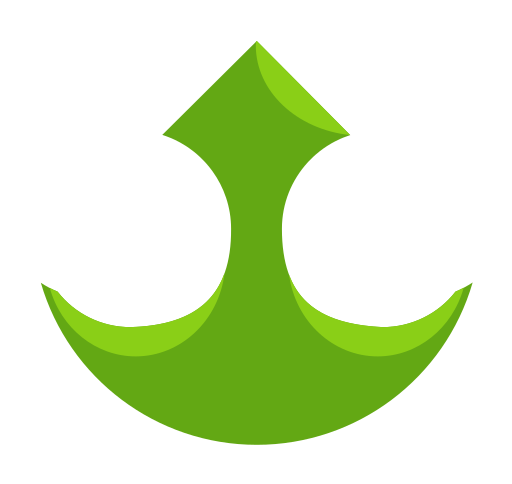

<p align="center">
  <a href="https://algacss.tedir.dev" target="_blank" rel="noopener noreferrer">
    
  </a>
</p>

<p align="center">
  <a href="https://npmcharts.com/compare/alga-css?minimal=true"></a>
  <a href="https://www.npmjs.com/package/alga-css"></a>
  <a href="https://www.npmjs.com/package/alga-css"></a>
</p>
<br/>

# Alga CSS
Alga CSS is a component oriented CSS framework for quickly inject, reuse or compose the style in a single file and can be called inside JavaScript framework SFC file. It can help build any Web Application faster by using defualt component first and then the component or the style can be modified to what the Client/Customer want.

All the main features:
1. Created for global/scoped CSS
2. As a PostCSS plugin
3. Can be stored as an Alga component (`@alga` directive and `.alga` format file)
4. And then can be converted to CSS component (`@layer` cascading inheritance)
5. Extract classes from any major JS Frameworks

## Installation and Setup
Alga CSS built on top of PostCSS, so before installing Alga CSS, you need to have PostCSS first and after that you can use NPM or Yarn to install this Alga CSS.

```sh
npm install alga-css --save-dev

#or

yarn add alga-css --dev

#or for testing (with next tag)

npm install alga-css@next --save-dev
```

If you use tool that support PostCSS out of the box like Vite for instance, you just need to create a new config file which is `postcss.config.cjs` and add the code below to that file.

```js
const algacss = require('alga-css')

module.exports = {
  plugins: [
    algacss({
      important: false, /*you may want to render style inside @layer cascading inheritance*/
      directive: 'use', /*insert 'layer' if you want a valid CSS, @layer instead of @use*/
      mode: '[data-mode={theme}]', /*you can replace it with '.{theme}-mode' */
      extract: [
        './src/**/*.html', 
        './src/**/*.{otherFormat}'
      ],
      src: './src/styles/*.alga',
      plugins: []
    })
  ]
}
```

## Compiling to CSS Cascading Inheritance
Alga CSS support converting component from `.alga` format file to `.css` file and it will compile all the code within `@alga` directive and place it inside `@layer` cascading inheritance and it can be imported directly to another CSS file or maybe injected to JS Framework via specific tools.

```sh
npx alga-css navBar ./path/to/navBar.css

#or

npx alga-css ./folder/navBar.alga ./folder/navBar.css
```

The command line above will generate a new CSS file with `@layer` cascading inheritance inside it after being executed in the terminal.

```css
/* ./folder/navBar.css */
@layer navBar {
  .navBar {
    ...
  }
}
```

## CSS Component
We provide `.alga` format file for storing styles as a component within `@alga` directive and can be converted to `@layer` cascade inheritance within `.css` file, this only happen if the `important` option has been set to `false`, this is because in the pass all utility-classes of Alga CSS rely on `!important` to override the css property value from certain component.

```css
/* navBar.alga */
@define refs {
  name: navBar;
}

@define props {
  size: 0.75rem;
}

@alga {refs.name} {
  .{refs.name} {
    ref: position-relative zIndex-3;
    ref-paddingTop: {props.size};
    ref-paddingBottom: {props.size};
  }
}

/* navBar.vue <style scoped> or app.css */
@use navBar {
  size: 20px;
}

/* set 'important: false' to render all the style within @layer */
@layer navBar {
  .navBar {
    position: relative;
    z-index: 3;
    padding-top: 20px; /* 0.75rem is the default that being override via props */
    padding-bottom: 20px;
  }
}
```

## State Management
Usually we use `props` to permanently changes the specific property value, but sometime we want to change all the values at one without having to replace it one by one, so here is why we provide state management and it must be put on top of all components.

```css
@use base;
@use container;
@use componentOne {
  bgActive: red;
}
@use componentTwo {
  bgActive: red;
}
@use componentThere {
  bgActive: red;
}
@use modules;
@use helpers;
```

Rather than passing value via props to each component one by one, we can use `@define state` instead, so we can rewrite all the component property values by just one line of code.

```css
@define states {
  bgActive: red;
}

@use base;
@use container;
@use componentOne;
@use componentTwo;
@use componentThere;
@use modules;
@use helpers;
```

## @layer instead of @use

Moreover, you may want to use only valid CSS syntax in any style sheets both global style or scoped style, so Alga CSS also provide a customizable directive, but only 2 values accepted which is either `use` or `layer` available.

```css
@define states {
  bgActive: red;
}

@layer base;
@layer container;
@layer componentOne;
@layer componentTwo;
@layer componentThere;
@layer modules;
@layer helpers;

/* or */
@layer base, container, componentOne, componentTwo, componentThere;
@layer modules;
@layer helpers;
```

Just one caveat, for `@layer modules;` and `@layer helpers;` cannot be stack together with other components and also for `props` only can be passed via state management or `@define states`.

## Class Name Structure
Alga CSS uses special character `-` to gab classes from HTML elements or Vue components, and it uses `:` for breakpoints and states and also `_` as a divider or separator of css values.

```css
/* highly recommended */
<span class="marginTop-0.75rem padding-10px md:marginTop-5pct color-rgb(205,45,67) backgroundColor-hexfff"></span>

.className {
  ref: marginTop-0.75rem padding-10px color-rgb(205,45,67) backgroundColor-hexfff;
  screen-md: marginTop-5pct;
}

/* class structure: property (camelCase for prop name and prop value separated by - or dash) */
justifyContent-spaceBetween

/* class structure: unit size (pct is unit size in percent) */
width-100pct
height-250px
padding-1.75rem

/* class structure: screen, ss (extra small), sr (smaller), sm (small), md (medium), lg (large), lr (larger), ls (largest), wd (wide), wr (wider) */
ss:paddingLeft-3px

/* class structure: mode */
dark:backgroundColor-hex242424
light:backgroundColor-hexf2f2f2

/* (prefers-color-scheme: light) { [data-mode=dark] .backgroundColor-hex242424 {} } */
toDark:backgroundColor-hex242424

/* (prefers-color-scheme: dark) { [data-mode=light] .backgroundColor-hexf2f2f2 {} } */
toLight:backgroundColor-hexf2f2f2

/* class structure: state */
hover:backgroundColor-hex2f2f2f
facus:paddingLeft-3px
```


